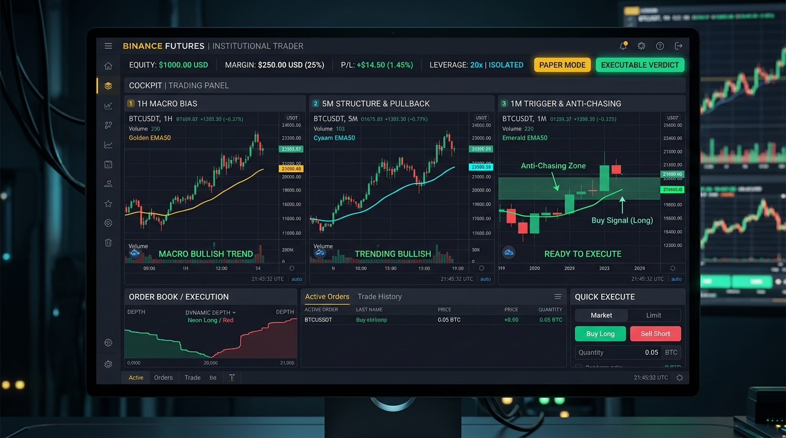
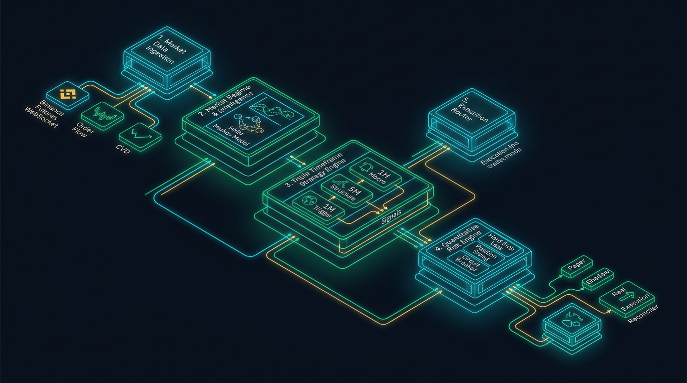

<div align="center">

# ⚡ SNIPER AI · QUANTITATIVE EXECUTION ENGINE
### *Institutional-Grade Algorithmic Trading Infrastructure for Binance USDⓈ-M Futures*

[](https://github.com/Rukawua26/Pbot-V5-StudioAI)
[](https://python.org)
[](https://binance.com)
[](https://github.com/Rukawua26/Pbot-V5-StudioAI/actions)
[]()
[]()

<br/>



<br/>

<p align="center">
  <b>Plataforma cuantitativa determinista de alta disponibilidad con motor multi-temporalidad (Triple Timeframe 1H/5M/1M), análisis de microestructura (CVD / Order Flow / Open Interest), gobernanza estricta de riesgo y Dashboard Cockpit interactivo.</b>
</p>

---

[📌 Resumen Ejecutivo](#-resumen-ejecutivo) •
[📐 Motor Triple Timeframe](#-motor-de-estrategia-triple-timeframe-1h--5m--1m) •
[🏛️ Arquitectura del Sistema](#-arquitectura-del-sistema) •
[🖥️ Dashboard BI Cockpit](#-dashboard-institucional--3-tf-cockpit) •
[🛡️ Gobernanza de Riesgo](#-gobernanza-de-riesgo-y-seguridad-operativa) •
[🚀 Despliegue & Operación](#-despliegue--operación) •
[🧪 CI/CD & Calidad](#-aseguramiento-de-calidad-y-validación)

---

</div>

## 📌 Resumen Ejecutivo

**Sniper AI** es una infraestructura cuantitativa modular de nivel institucional desarrollada para la ejecución autónoma de estrategias de trading en el mercado de derivados **Binance USDⓈ-M Futures**. Diseñada bajo los principios de **State-Locking, Determinismo Quirúrgico y Zero-Trust Execution**, la plataforma prioriza la preservación de capital, la colocación estricta de **Hard Stop Loss** en el exchange y el monitoreo continuo en vivo.

> [!IMPORTANT]
> **Filosofía Operational Invariant**: El exchange es la **única fuente de verdad** para la exposición real. Ninguna orden se envía sin validación previa del Risk Engine, y ninguna posición activa puede permanecer en modo `REAL` sin una orden `HARD STOP LOSS` confirmada en el orderbook.

### 🌟 Capacidades Nucleares

- 🎯 **Motor Triple Timeframe (1H / 5M / 1M)**: Alineación jerárquica de 3 marcos temporales: Sesgo Macro 1H, Estructura & Pullback 5M y Gatillo 1M con corredor de protección **Anti-Chasing ($\pm 0.6\%$)**.
- 🖥️ **Dashboard Interactivo 3-TF Cockpit**: Consola web de alta densidad (High-DPI Canvas 2D) con sincronización automática en vivo al seleccionar cualquier moneda de la tabla Radar.
- 🔮 **Clasificación Estocástica de Regímenes (HMM Markov)**: Detección dinámica del régimen de mercado (`BULLISH`, `BEARISH`, `RANGE`) sobre Bitcoin mediante cadenas ocultas de Markov.
- 🌊 **Microestructura & Order Flow (CVD / OI)**: Análisis de transacciones agresoras tick-a-tick (*Cumulative Volume Delta*) y variaciones sopesadas de apalancamiento (*Open Interest*).
- 🛡️ **Gobernanza Cuantitativa de Riesgo**: Sizing adaptativo por volatilidad ATR y balance, matriz de correlación cruzada entre pares y Circuit Breaker por drawdown diario UTC.
- 🔒 **Aislamiento Estricto de Modos**: Separación matemática entre `PAPER` (simulado $1,000 virtual), `SHADOW` (telemetría observacional) y `REAL` (autenticación HMAC con firma de claves y permisos Futures).

---

## 📐 Motor de Estrategia Triple Timeframe (1H / 5M / 1M)

El motor principal `triple_tf` opera mediante una cadena jerárquica de decisión que elimina entradas impulsivas y garantiza una alta esperanza matemática:

```text
┌──────────────────────────────────────────────────────────────────────────────────────┐
│                                TRIPLE TIMEFRAME DECISION CHAIN                       │
│                                                                                      │
│   [ MARCO 1H: SESGO MACRO ]                                                          │
│   Determina la dirección dominante (BUY / SELL / NEUTRAL) evaluando la posición del  │
│   precio respecto a la EMA 50 1H y filtros de mechas de rechazo.                     │
│         │                                                                            │
│         ▼ (Si 1H es BUY o SELL)                                                      │
│   [ MARCO 5M: ESTRUCTURA & PULLBACK ]                                                │
│   Verifica la ruptura de estructura (MSS) y el retroceso/toque a la EMA 50 5M.      │
│   Establece el Stop Loss sugerido en el Swing High / Swing Low.                      │
│         │                                                                            │
│         ▼ (Si 5M confirma Setup)                                                     │
│   [ MARCO 1M: GATILLO & ANTI-CHASING ]                                               │
│   Confirma el rebote o cruce favorable en 1M dentro del corredor de protección       │
│   Anti-Chasing (máximo ±0.6% de distancia a la EMA 50 1M).                           │
│         │                                                                            │
│         ▼ (Alineación Completa de los 3 Marcos)                                      │
│   [ VEREDICTO FINAL: 🚀 EJECUTABLE ] ──▶ Disparo de Orden + Hard Stop Loss           │
└──────────────────────────────────────────────────────────────────────────────────────┘
```

> [!TIP]
> **Corredor Anti-Chasing ($\pm 0.6\%$)**: En el marco de 1M, el motor proyecta una franja porcentual alrededor de la EMA 50 1M. Si el precio se aleja más del $0.6\%$ antes del gatillo, la entrada se invalida temporalmente para evitar comprar techos o vender suelos.

---

## 🏛️ Arquitectura del Sistema

El flujo de procesamiento opera como una tubería determinista desacoplada, garantizando que ninguna orden se envíe al exchange sin la validación previa de todas las capas de seguridad y riesgo.



### Módulos Principales

| Módulo | Responsabilidad Operativa | Archivos Clave |
| :--- | :--- | :--- |
| **Data Ingestion** | Ingesta de Klines, Mark Price, Tickers, Open Interest y Order Flow (WebSocket `aggTrade`). | [`core/bot_connection.py`](file:///home/miguel/Pbot-V5-StudioAI/core/bot_connection.py) |
| **Market Intelligence** | Clasificación HMM Markov, ranking de liquidez Triage y matriz de correlación. | [`core/market_intelligence.py`](file:///home/miguel/Pbot-V5-StudioAI/core/market_intelligence.py) |
| **Triple TF Engine** | Análisis 1H (Sesgo), 5M (Estructura) y 1M (Gatillo Anti-Chasing). | [`core/strategy/triple_tf/`](file:///home/miguel/Pbot-V5-StudioAI/core/strategy/triple_tf/) |
| **Risk Engine** | Sizing adaptativo ATR, guardrail `MAX_ENTRY_SL_PCT = 3.0%` y Circuit Breaker. | [`core/trade_entry.py`](file:///home/miguel/Pbot-V5-StudioAI/core/trade_entry.py) |
| **Execution Router** | Ruteo a adaptadores `PAPER`, `SHADOW` y `REAL` con reconexión ininterrumpida. | [`core/execution_adapters.py`](file:///home/miguel/Pbot-V5-StudioAI/core/execution_adapters.py) |

---

## 🖥️ Dashboard Institucional & 3-TF Cockpit

El bot incluye una consola interactiva web ligera servida por **FastAPI** (`tools/dashboard_api_server.py`) o **Node.js** (`server.js`):

```text
┌────────────────────────────────────────────────────────────────────────────────────────┐
│                                   SNIPER AI DASHBOARD                                  │
├───────────────┬───────────────────────────┬────────────────────────────┬───────────────┤
│ ⚡ TERMINAL   │  🎯 RADAR DE PARES        │  📈 COCKPIT TRIPLE TF      │  📊 EQUITY    │
│ Balance PnL   │  Top 10 / 30 Liquidez     │  Vistas 1H, 5M y 1M        │  Historial    │
│ Posiciones    │  Clic ──▶ Sync a Cockpit  │  Gráficos Canvas2D HD      │  Curva PnL    │
└───────────────┴───────────────────────────┴────────────────────────────┴───────────────┘
```

> [!NOTE]
> **Sincronización Interactiva**: Al hacer clic en cualquier par de la tabla **Radar** (ej. `BTC/USDT`, `ETH/USDT`, `ZEC/USDT`), la interfaz activa automáticamente el visor 3-TF Cockpit, consulta las series temporales en tiempo real y renderiza los 3 gráficos Canvas simultáneamente.

---

## 🛡️ Gobernanza de Riesgo y Seguridad Operativa

```text
┌──────────────────────────────────────────────────────────────────────────────────────┐
│                                ESTADOS DEL TRADE EN RUNTIME                          │
│                                                                                      │
│   [PENDING_SEND]                                                                     │
│         │                                                                            │
│         ▼                                                                            │
│   [PENDING_EXCHANGE_OPEN] ──▶ ACK de Orden Confirmado por Exchange                   │
│         │                                                                            │
│         ▼                                                                            │
│   [ENTRY_FILLED_AWAITING_POSITION_SYNC] ──▶ Reconciliación Inmediata con Wallet     │
│         │                                                                            │
│         ▼                                                                            │
│   [OPEN (HARD SL CONFIRMADO)] ──▶ Hard Stop Loss Activo en el Orderbook              │
│         │                                                                            │
│         ▼                                                                            │
│   [CLOSING_INITIATED] ──▶ Cierre por TP / Trailing SL / Emergency Fail-Safe          │
│         │                                                                            │
│         ▼                                                                            │
│   [CLOSED (FLAT)] ──▶ Auditoría JSONL + Reconciliación de Balance Final              │
└──────────────────────────────────────────────────────────────────────────────────────┘
```

> [!WARNING]
> **Orden Ascendente de Locks (Prevención Invariable de Deadlocks)**:
> `bot.lock` < `execution._exchange_call_lock` < `execution._account_lock` < `shadow._lock` < `bot.db_lock` < `bot.price_lock`

---

## 🚀 Despliegue & Operación

### 1. Requisitos Previos

- **Python**: `3.12+` con entorno virtual (`./.venv/`)
- **Node.js**: (Opcional) `v18+` para servidor de desarrollo
- **Binance API Keys**: (Solo modo `REAL`) Permisos de **Futures Trading** activos.

### 2. Instalación Rápida

```bash
# 1. Clonar el repositorio
git clone https://github.com/Rukawua26/Pbot-V5-StudioAI.git
cd Pbot-V5-StudioAI

# 2. Crear el entorno virtual e instalar dependencias del lockfile
python3 -m venv .venv
source .venv/bin/activate
./.venv/bin/python -m pip install -r requirements.lock -r requirements-dev.lock

# 3. Configurar entorno .env
cp .env.example .env
```

### 3. Modos de Ejecución

```bash
# Opción A: Bot Principal de Trading (PAPER / REAL)
./.venv/bin/python main.py

# Opción B: Servidor API Dashboard (Production FastAPI)
SNIPER_DISABLE_FILE_TELEMETRY=1 ./.venv/bin/python tools/dashboard_api_server.py

# Opción C: Servidor Dashboard Node.js (Dev / Demo)
node server.js
```

---

## 🧪 Aseguramiento de Calidad y Validación

La suite completa de pruebas en CI/CD valida la estabilidad del runtime antes de cualquier commit:

```bash
# Dependencias y compilación
./.venv/bin/python -m pip check
./.venv/bin/python -m compileall -q main.py core tools

# Calidad de código y tipo
./.venv/bin/ruff check core/ tests/ tools/
MYPYPATH=. ./.venv/bin/mypy --explicit-package-bases core/config/ core/types.py core/bot_facade.py core/execution_adapters.py

# Gates de seguridad y contratos
PYTHON_BIN=./.venv/bin/python bash scripts/smoke_modular_imports.sh
./.venv/bin/python tools/check_no_silent_pass.py
SNIPER_DISABLE_FILE_TELEMETRY=1 ./.venv/bin/python tools/regression_contracts.py

# Simulación de Caos y Drill de Recuperación
SNIPER_DISABLE_FILE_TELEMETRY=1 ./.venv/bin/python tools/chaos_matrix.py
SNIPER_DISABLE_FILE_TELEMETRY=1 ./.venv/bin/python tools/recovery_drill.py

# Suite Unitaria Completa (1,297 Pruebas OK)
SNIPER_DISABLE_FILE_TELEMETRY=1 ./.venv/bin/python -m unittest discover -s tests -p "test_*.py"
```

---

## 📑 Gobernanza Técnica

- 📖 [Memoria Técnica del Proyecto](docs/engineering/memoria-tecnica.md)
- 📋 [Mejoras Pendientes & Roadmap](docs/roadmap/mejoras-pendientes.md)
- 🤖 [Manual de Agentes (AGENTS.md)](AGENTS.md)

---

<div align="center">
  <sub>Desarrollado para ejecución cuantitativa segura en Binance Futures. © 2026 Sniper AI.</sub>
</div>
