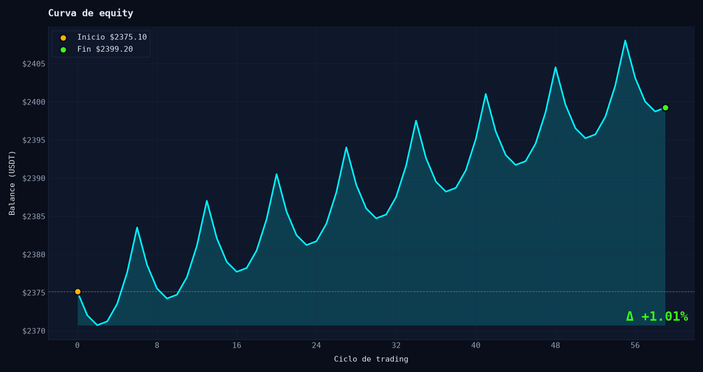
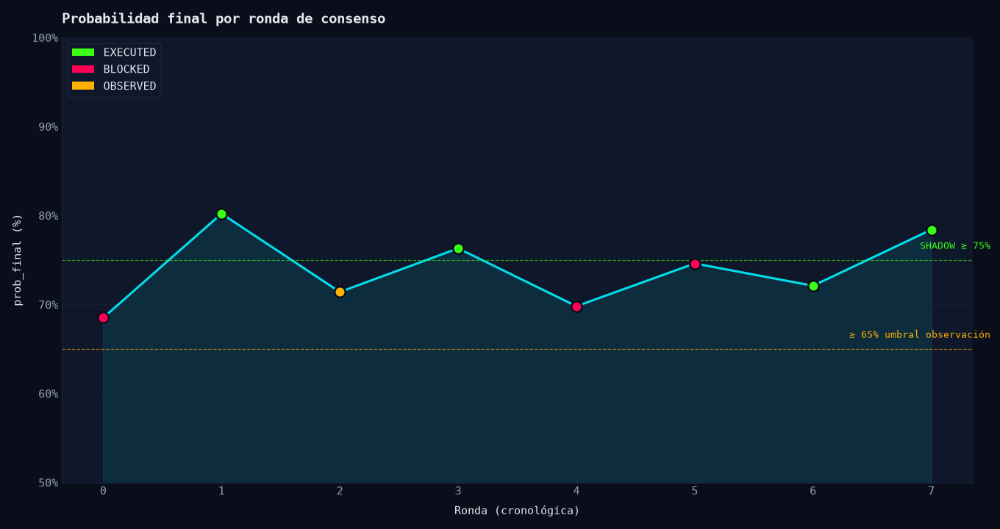
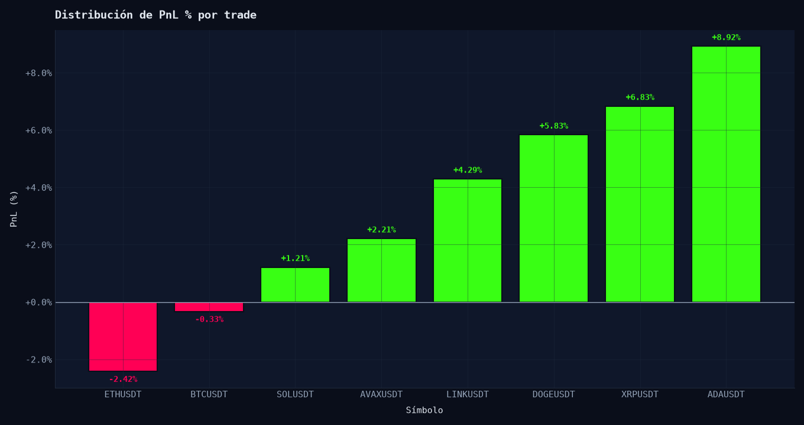
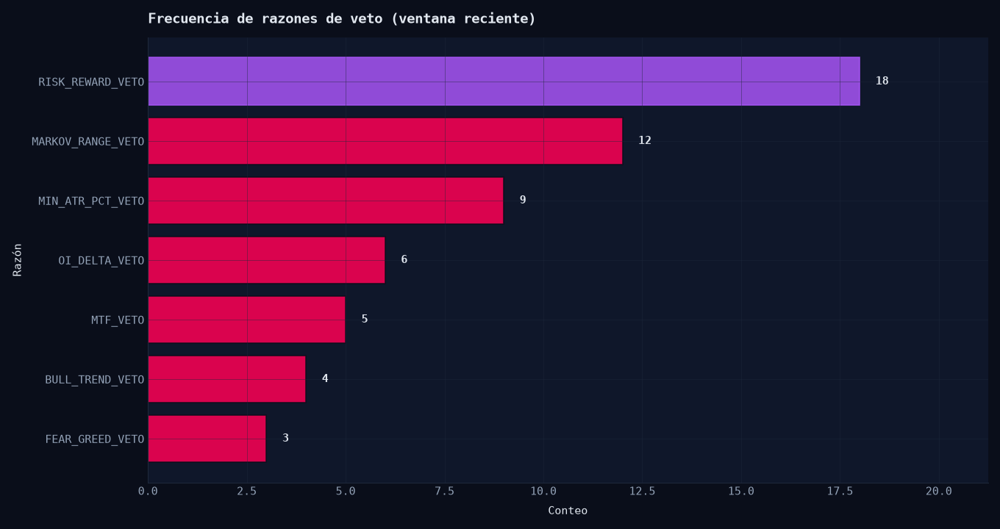
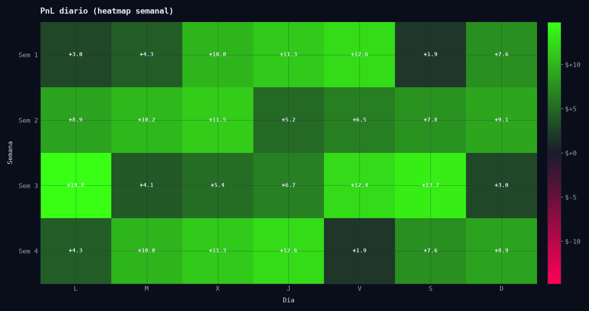
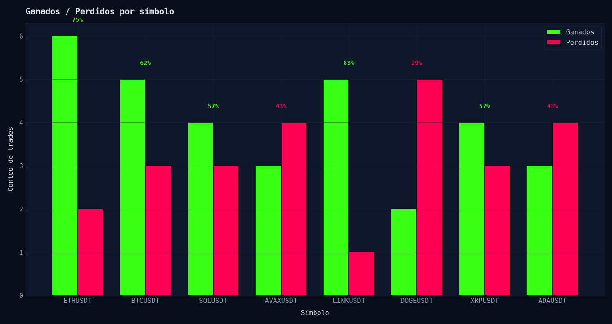

<div align="center">

# ⚡ SNIPER AI · QUANTITATIVE EXECUTION ENGINE
### *Institutional-Grade Algorithmic Trading Infrastructure for Binance USDⓈ-M Futures*

[](https://github.com/Rukawua26/Pbot-V5ARCH-DEV-clean)
[](https://python.org)
[](https://binance.com)
[](https://github.com/Rukawua26/Pbot-V5ARCH-DEV-clean/actions)
[]()
[]()

<br/>

```
[ Market Microstructure ] ──▶ [ HMM Regime Classification ] ──▶ [ Multi-Agent Alpha Engine ]
                                                                             │
[ Real-Time Telemetry & BI ] ◀── [ Hardened Execution Router ] ◀── [ Dynamic Risk Governance ]
```

<p align="center">
  <b>Arquitectura algorítmica determinista de alta disponibilidad con clasificación estocástica de regímenes de mercado, análisis de microestructura (CVD / Order Flow / Open Interest), gobernanza estricta de riesgo y simulación shadow concurrente.</b>
</p>

---

[Resumen Ejecutivo](#-resumen-ejecutivo) •
[Arquitectura del Sistema](#-arquitectura-del-sistema) •
[Módulos Cuantitativos](#-módulos-cuantitativos) •
[Gobernanza de Riesgo](#-gobernanza-de-riesgo-y-seguridad-operativa) •
[Dashboard & Telemetría](#-dashboard-institucional--bi) •
[Despliegue & Operación](#-despliegue--operación) •
[CI/CD & Calidad](#-aseguramiento-de-calidad-y-validación) •
[Documentación](#-gobernanza-técnica-y-runbooks)

---

</div>

## 📌 Resumen Ejecutivo

**Sniper AI** es una plataforma cuantitativa modular de nivel institucional desarrollada para la ejecución autónoma en el mercado de derivados **Binance USDⓈ-M Futures**. Diseñada bajo la filosofía **Runtime-First & Zero-Trust State**, la infraestructura prioriza la preservación de capital, la trazabilidad estricta de órdenes y la resiliencia operativa ante condiciones anómalas de mercado.

### Capacidades Nucleares

- **Clasificación Estocástica de Regímenes (HMM Markov)**: Detección dinámica de estados de mercado (`BULLISH`, `BEARISH`, `RANGE`) con matrices de probabilidad de transición aplicadas como modulador de confianza sobre los modelos de entrada.
- **Consenso Multi-Agente & Microestructura**: Síntesis de señales provenientes de agentes especializados (Momentum Breakout, Mean Reversion, Kinetic S/R, Redes Neuronales Ghost) validados por flujo de órdenes agresor (CVD), delta de Open Interest y análisis multi-temporalidad (MTF 15m/5m/1h).
- **Gestión Cuantitativa de Riesgo (Risk Governance)**: Sizing dinámico adaptativo mediante distancia ATR / SL, matriz de co-riesgo por correlación cruzada en tiempo real, circuit breaker por drawdown diario UTC y enforcement incondicional de **Hard Stop Loss** en el exchange.
- **Laboratorio de Ejecución Shadow (Zero-Capital Sandbox)**: Evaluación paralela de hasta 20 estrategias concurrentes sobre datos en vivo con modelado de latencia de red, slippage asimétrico y tasas de rechazo antes de la asignación de capital real.
- **Telemetría Institucional & Reconciliación Continua**: Reconciliación atómica entre balance local y estado del broker, auditoría JSONL inmutable, dashboard web interactivo con zoom lightbox y control remoto seguro vía Telegram.

---

## 🏛️ Arquitectura del Sistema

El flujo de procesamiento opera como una tubería determinista desacoplada, garantizando que ninguna orden se envíe al exchange sin la validación previa de todas las capas de seguridad y riesgo.

```text
┌────────────────────────────────────────────────────────────────────────────────────────┐
│                                 MARKET DATA INGESTION                                  │
│   Binance Futures WebSocket (Mark Price / Tickers / Klines) + REST API (Open Interest) │
│   WebSocket AggTrade Stream (Order Flow / Cumulative Volume Delta - CVD)               │
└───────────────────────────────────────────┬────────────────────────────────────────────┘
                                            │
                                            ▼
┌────────────────────────────────────────────────────────────────────────────────────────┐
│                              MARKET REGIME & INTELLIGENCE                              │
│   Hidden Markov Model (HMM) ──▶ Probabilidades de Transición [BULL / BEAR / RANGE]     │
│   Dynamic Liquidity Guard   ──▶ Spread Filter + 30-Pair Real-Time Triage Matrix        │
└───────────────────────────────────────────┬────────────────────────────────────────────┘
                                            │
                                            ▼
┌────────────────────────────────────────────────────────────────────────────────────────┐
│                           MULTI-AGENT ALPHA GENERATION ENGINE                          │
│   ┌───────────────────────┬─────────────────────────┬──────────────────────────────┐   │
│   │ Momentum Trend (MT)   │ Kinetic S/R & Flow (SR) │ Neural Ghost Predictor (G)   │   │
│   └───────────────────────┴─────────────────────────┴──────────────────────────────┘   │
│   CycleContext (Snapshot Inmutable) + Multi-Timeframe Confirmation (15m / 5m / 1h)     │
└───────────────────────────────────────────┬────────────────────────────────────────────┘
                                            │
                                            ▼
┌────────────────────────────────────────────────────────────────────────────────────────┐
│                        QUANTITATIVE RISK ENGINE & GOVERNANCE                           │
│   • Pairwise Correlation Matrix (Veto a sobreexposición > 0.80)                        │
│   • Open Interest Delta Filter (Protección contra Squeezes y Liquidaciones)            │
│   • Sizing Adaptativo por Volatilidad (ATR) y Drawdown Diario UTC Circuit Breaker      │
│   • Hard Stop Loss Pre-Execution Calculation & Trailing Stop Invariants                │
└───────────────────────────────────────────┬────────────────────────────────────────────┘
                                            │
                                            ▼
┌────────────────────────────────────────────────────────────────────────────────────────┐
│                              EXECUTION ROUTER & TELEMETRY                              │
│   ┌────────────────────────────────────────┬───────────────────────────────────────┐   │
│   │ LIVE EXECUTION ADAPTER (REAL / PAPER)  │ SHADOW EXECUTION LAB (Virtual Sandbox)│   │
│   └────────────────────────────────────────┴───────────────────────────────────────┘   │
│   Atomic Guardian Vigilance ──▶ Emergency Market Close ──▶ State Reconciler            │
│   Web Dashboard (FastAPI/Static) + Telegram Command Center + GitHub Projects v2 Kanban │
└────────────────────────────────────────────────────────────────────────────────────────┘
```

---

## 🧬 Módulos Cuantitativos y Modelado

### 1. Clasificación de Régimen por Cadenas de Markov Ocultas (HMM)
En lugar de depender de indicadores rezagados univariados, el motor entrena modelos HMM sobre la serie temporal de Bitcoin (BTCUSDT) para identificar el estado latente del mercado.
- **`BULLISH`**: Habilita estrategias tendenciales con sizing completo (1.0x) y trailing dinámico de 1.8 ATR.
- **`BEARISH`**: Activa modo de cobertura; restringe compras direccionales y aplica filtros estrictos a ventas en corto.
- **`RANGE`**: Modula a estrategias de reversión a la media con bandas Bollinger/RSI, reduciendo el sizing general (0.5x) para mitigar el desgaste por chop.

### 2. Microestructura & Order Flow (CVD & Open Interest)
- **Cumulative Volume Delta (CVD)**: Procesa transacciones agresoras tick-a-tick vía WebSocket `aggTrade` para cuantificar la absorción institucional y divergencias precio-delta.
- **Open Interest Delta**: Detecta anomalías de apalancamiento súbito, vetando entradas susceptibles a cascadas de liquidación o trampas de volatilidad (short/long squeezes).

### 3. Síntesis de Consenso Multi-Agente
- **Kinetic Support/Resistance**: Análisis cinético de velas con Z-Score de aceleración (Multiplicador ×1.3 en zonas de absorción confirmada, penalización ×0.7 ante cuchillos cayendo).
- **Red Neuronal Ghost**: Modelo probabilístico no lineal que evalúa la calidad estructural de la configuración técnica antes de emitir autorización.

---

## 🛡️ Gobernanza de Riesgo y Seguridad Operativa

> **Invariante Nuclear:** *El estado del exchange es la única fuente de verdad sobre la exposición real. Ninguna posición en modo REAL puede existir sin una orden `HARD STOP LOSS` activa y confirmada.*

```
┌──────────────────────────────────────────────────────────────────────────────────────┐
│                                ESTADOS DEL TRADE EN RUNTIME                          │
│                                                                                      │
│   [PENDING_SEND]                                                                     │
│         │                                                                            │
│         ▼                                                                            │
│   [PENDING_EXCHANGE_OPEN] ──▶ ACK de Orden Confirmado por Exchange                   │
│         │                                                                            │
│         ▼                                                                            │
│   [ENTRY_FILLED_AWAITING_POSITION_SYNC] ──▶ Reconciliación Inmediata con Wallet     │
│         │                                                                            │
│         ▼                                                                            │
│   [OPEN (HARD SL CONFIRMADO)] ──▶ Hard Stop Loss Activo en el Orderbook              │
│         │                                                                            │
│         ▼                                                                            │
│   [CLOSING_INITIATED] ──▶ Cierre por TP / Trailing SL / Emergency Fail-Safe          │
│         │                                                                            │
│         ▼                                                                            │
│   [CLOSED (FLAT)] ──▶ Auditoría JSONL + Reconciliación de Balance Final              │
└──────────────────────────────────────────────────────────────────────────────────────┘
```

### Salvaguardas Críticas de Producción

1. **Protocolo Fail-Safe de Fills Reales (`execute_order`)**:
   - Tras el envío de una orden de entrada, el sistema consulta de inmediato `fetch_positions()`.
   - Si se detecta exposición sin confirmación o con discrepancias en el `orderId`, el motor activa `HALT` preventivo (`ENTRY_ORDER_ID_UNVERIFIED`) para impedir duplicación de contratos.
2. **Validación Exhaustiva de Hard Stop Loss (`hard_sl_ack_looks_valid`)**:
   - Toda orden de stop loss requiere verificación estricta: `id` activo, estado `NEW`/`OPEN`, tipo `STOP_MARKET`, `reduceOnly=true` y tolerancia cuantitativa de volumen coincidente con la posición.
   - Si el broker rechaza el SL (e.g. error `-2021: would trigger immediately`), el motor ejecuta un **Emergency Market Close** inmediato para eliminar exposición no protegida.
3. **Matriz de Co-Riesgo por Correlación Dinámica**:
   - Monitoreo continuo de coeficientes de correlación de Pearson entre pares activos.
   - Aplica reducciones escalonadas de tamaño o vetos totales de entrada ante coeficientes superiores a `+0.80`, evitando correlaciones ocultas en carteras de altcoins.
4. **Circuit Breakers por Drawdown UTC**:
   - Suspensión automática de operaciones intradiarias si el drawdown diario acumulado alcanza el límite de seguridad (default 5.0%), bloqueando la apertura de nuevas posiciones hasta el reinicio del ciclo UTC.
5. **Jerarquía Estricta de Locks Concurrenciales**:
   - Prevención matemática de interbloqueos (*deadlocks*) mediante ordenamiento ascendente riguroso:
     $$\text{bot.lock} \prec \text{execution.\_exchange\_call\_lock} \prec \text{execution.\_account\_lock} \prec \text{shadow.\_lock} \prec \text{bot.db\_lock} \prec \text{bot.price\_lock}$$

---

## 📊 Dashboard Institucional & BI

La plataforma incorpora una consola web reactiva de grado profesional (`FastAPI` + `Vanilla JS/Tailwind`) configurada para monitoreo de baja latencia:

<div align="center">

| Módulo de BI | Visualización | Métrica / Función Clave |
|---|---|---|
| **Curva de Equity** |  | Balance acumulado en vivo con $\Delta\%$ y drawdown |
| **Consenso de Agentes** |  | Distribución de probabilidades y umbrales de disparo |
| **Distribución PnL** |  | Histograma de retorno por trade y factor de beneficio |
| **Análisis de Vetos** |  | Frecuencia de rechazos por filtros de riesgo |
| **Heatmap Semanal** |  | Calendario de consistencia y rendimiento diario |
| **Winrate por Par** |  | Tasa de acierto desglosada por activo cotizado |

</div>

### Características del Dashboard

- **Matriz de Correlación con Lightbox Zoom**: Inspección ampliada a pantalla completa de la matriz de calor cross-asset con cálculo de co-riesgo en tiempo real.
- **Radar de Señales con Densidad Adaptativa**: Selector de vista compacta/espaciada con persistencia local y columnas congeladas (*sticky*) para auditoría en dispositivos móviles.
- **Semáforo Interactivo de Régimen HMM**: Inspección de los multiplicadores estratégicos activos según el estado estocástico de BTC.
- **Acordeón Agrupado de Configuración**: Parametrización en vivo categorizada por filtros de tendencia, liquidez, riesgo, motor de ejecución y entorno.

---

## 🎮 Modos de Operación

El motor permite alternar entre distintos entornos de ejecución garantizando aislamiento total de memoria y estado:

```bash
# Modo PAPER (Por defecto en instalaciones iniciales)
PAPER_MODE=true
ALLOW_REAL_TRADING=false
EXECUTION_BACKEND=live

# Modo SHADOW LIVE (Simulación concurrente sobre orderbook real)
PAPER_MODE=true
ALLOW_REAL_TRADING=false
EXECUTION_BACKEND=shadow_live
MAX_SHADOW_TRADES=20

# Modo PRODUCCIÓN REAL (Requiere checklist de runbook y claves con permisos)
PAPER_MODE=false
ALLOW_REAL_TRADING=true
EXECUTION_BACKEND=live
```

| Modo | Capital | Red de Datos | Órdenes en Exchange | Caso de Uso |
|---|---|---|:---:|---|
| 🟦 **`PAPER`** | Virtual | Binance Live | No | Calibración de filtros y validación de conectividad |
| 👻 **`SHADOW`** | Virtual | Binance Live | No | Benchmark de hasta 20 estrategias en paralelo con slippage |
| 🧪 **`TESTNET`** | Testnet | Binance Testnet | Sí (Sandbox) | Verificación de callbacks y ciclo de órdenes |
| 🟥 **`REAL`** | Real | Binance Live | **Sí (Real)** | Ejecución de capital con salvaguardas y Hard SL activos |

---

## 🚀 Despliegue & Operación

### Requisitos de Sistema
- **Sistema Operativo**: Linux (Ubuntu 22.04+ / Debian 12 / Arch), Windows 11 / Server 2022.
- **Python**: Versión `3.12+` x86_64.
- **Conectividad**: Acceso de baja latencia a los endpoints de Binance Futures (`fapi.binance.com`).

### 1. Instalación Rápida (Entorno Local)

```bash
# 1. Clonar el repositorio
git clone https://github.com/Rukawua26/Pbot-V5ARCH-DEV-clean.git
cd Pbot-V5ARCH-DEV-clean

# 2. Configurar entorno virtual con dependencias verificadas
python3.12 -m venv .venv
source .venv/bin/activate
pip install --upgrade pip
pip install -r requirements.lock -r requirements-dev.lock

# 3. Parametrizar variables de entorno
cp .env.example .env
# Configurar API keys y parámetros en .env

# 4. Iniciar el motor
./.venv/bin/python main.py
```

### 2. Despliegue Automatizado en Servidores VPS / Google Cloud (1-Click Setup)

Para desplegar en instancias gratuitas de **Google Cloud (e2-micro Always Free)** o VPS con 1 GB de RAM, el script automatizado configura la memoria SWAP de 2 GB, el entorno virtual `.venv` y las dependencias:

```bash
# Opción 1: Ejecutar directamente desde el repositorio clonado
git clone https://github.com/Rukawua26/Pbot-V5ARCH-DEV-clean.git
cd Pbot-V5ARCH-DEV-clean
bash scripts/setup_vps.sh

# Opción 2: Instalación directa remota en 1 comando (curl)
curl -sSL https://raw.githubusercontent.com/Rukawua26/Pbot-V5ARCH-DEV-clean/main/scripts/setup_vps.sh | bash
```

### 3. Despliegue en Servidores VPS / Bare Metal (`systemd`)

Para entornos de producción 24/7 con reinicio automático ante fallos:

```bash
# Instalar y habilitar el servicio watchdog systemd
bash tools/install_watchdog_systemd.sh

# Comandos de administración
systemctl --user status sniper-ai.service --no-pager
systemctl --user restart sniper-ai.service
journalctl --user -u sniper-ai.service -f -n 100
```

### 3. Despliegue en Contenedores (`Docker`)

```bash
# Construir imagen optimizada
docker build -t sniper-ai:latest .

# Despliegue mediante Docker Compose
docker compose up -d --build
```

### 4. Distribuciones Portables Autónomas (Windows / Linux)
Los binarios portables se compilan y publican automáticamente en **GitHub Releases** mediante el flujo de CI/CD:
- **Windows**: `SniperBot-Windows-Portable.zip` (Ejecutable nativo con configuración en `%APPDATA%\SniperBot`).
- **Linux**: `SniperBot-Linux-Portable.tar.gz` (Binario autónomo con configuración en `~/.config/SniperBot`).

---

## 📲 Control Remoto y Monitoreo vía Telegram

El bot integra un centro de mando asíncrono con control de acceso por ID de usuario:

```text
/status         ─── Estado del runtime, balance, exposición y régimen actual
/open           ─── Lista de posiciones activas con PnL no realizado y trailing SL
/pipeline       ─── Telemetría del ciclo de escaneo y filtros de triaje
/shadow_stats   ─── Rendimiento y estadísticas del laboratorio shadow
/intelligence   ─── Consulta del informe ejecutivo y advisories consultivos
/explain <SYM>  ─── Desglose de decisión cuantitativa sobre un activo
/pause          ─── Pausa preventiva de nuevas entradas (mantiene gestión de abiertas)
/panic          ─── Veto total y cierre de emergencia a mercado de todas las posiciones
```

---

## 🧪 Aseguramiento de Calidad y Validación

La infraestructura se somete a una rigurosa suite de pruebas automatizadas y simulaciones de caos antes de cada despliegue:

```bash
# 1. Compilación estática de bytecode
./.venv/bin/python -m compileall -q main.py core

# 2. Análisis estático de tipos y estilo
./.venv/bin/ruff check core/ tests/
MYPYPATH=. ./.venv/bin/mypy --explicit-package-bases core/config/ core/types.py core/bot_facade.py core/execution_adapters.py

# 3. Verificación de políticas anti-silent-pass y contratos de arquitectura
./.venv/bin/python tools/check_no_silent_pass.py
SNIPER_DISABLE_FILE_TELEMETRY=1 ./.venv/bin/python tools/regression_contracts.py

# 4. Simulacros de caos y recuperación de exchange
SNIPER_DISABLE_FILE_TELEMETRY=1 ./.venv/bin/python tools/chaos_matrix.py
SNIPER_DISABLE_FILE_TELEMETRY=1 ./.venv/bin/python tools/recovery_drill.py

# 5. Suite unitaria completa y gate de cobertura (Fail under 75%)
SNIPER_DISABLE_FILE_TELEMETRY=1 ./.venv/bin/python -m coverage run -m unittest discover -s tests -p "test_*.py"
./.venv/bin/python -m coverage report --fail-under=75

# 6. Prueba de invarianza temporal
SNIPER_DISABLE_FILE_TELEMETRY=1 ./.venv/bin/python -m unittest tests/test_temporal_invariance.py

# 7. Auditoría estricta de vulnerabilidades en dependencias
./.venv/bin/python -m pip_audit --strict
```

### Métricas de Calidad de Código
- **Suite de Pruebas**: **1259 tests exitosos** (0 fallos, 2 omitidos por entorno).
- **Cobertura de Código**: **78%** de cobertura en módulos nucleares de ejecución.
- **Seguridad**: `pip-audit` con 0 vulnerabilidades conocidas (CVEs mitigados).

---

## 📂 Estructura del Repositorio

```text
Pbot-V5ARCH-DEV-clean/
├── main.py                     # Entrypoint ultra-ligero (delegación en core.bot_app)
├── core/                       # Núcleo del motor cuantitativo
│   ├── bot_app.py              # Bootstrap de servicios, ciclo de eventos e inyección de dependencias
│   ├── bot_facade.py           # Contrato público e interfaz de control
│   ├── bot_guardian.py         # Monitor atómico de posiciones y Hard Stop Loss
│   ├── bot_connection.py       # Gestión segura de credenciales y transporte Binance
│   ├── execution_adapters.py   # Adaptadores de ejecución: live y shadow_live
│   ├── reconciliation.py       # Algoritmo de recuperación y alineación DB/Exchange
│   ├── risk_engine.py          # Motor de sizing por ATR, correlación y circuit breakers
│   ├── trade_entry.py          # Pipeline determinista de apertura y verificación de fills
│   ├── trade_exit.py           # Gestión de salidas idempotentes y trailing stops
│   ├── config/                 # Gestor canónico de configuración y umbrales tipados
│   ├── signals/                # Filtros de microestructura (OI, CVD, Spread, Regímenes)
│   └── strategy/               # Agentes analíticos (Momentum, Kinetic S/R, Neural Ghost)
├── dashboard/                  # Interfaz web analítica institucional
│   └── static/index.html       # Single Page Application reactiva con telemetría en tiempo real
├── deploy/                     # Scripts y configuraciones para systemd y contenedores
├── docs/                       # Documentación técnica, memoria y runbooks operativos
│   ├── engineering/            # Memoria técnica de decisiones arquitectónicas
│   ├── roadmap/                # Backlog cuantitativo y mejoras planificadas
│   └── runbooks/               # Protocolos de operación, contingencia y pilotaje REAL
├── packaging/                  # Especificaciones PyInstaller para releases portables
├── tests/                      # Suite integral de pruebas unitarias, integración y caos
└── tools/                      # Herramientas auxiliares, simuladores y kanban
```

---

## 📚 Gobernanza Técnica y Runbooks

Para procedimientos detallados de operación y contingencia, consulte la documentación oficial en el repositorio:

| Documento | Enfoque Operativo |
|---|---|
| [`docs/engineering/memoria-tecnica.md`](docs/engineering/memoria-tecnica.md) | Memoria técnica de cambios, invariantes de seguridad y contratos |
| [`docs/runbooks/real-trading.md`](docs/runbooks/real-trading.md) | Checklist mandatario de pre-vuelo para operaciones con capital real |
| [`docs/runbooks/recovery.md`](docs/runbooks/recovery.md) | Protocolos de resolución ante desincronización o caídas de red |
| [`docs/runbooks/chaos-validation.md`](docs/runbooks/chaos-validation.md) | Matriz de pruebas de inyección de fallos de exchange y API |
| [`docs/runbooks/risk-governance.md`](docs/runbooks/risk-governance.md) | Jerarquía de decisiones de riesgo y políticas de veto de órdenes |
| [`docs/runbooks/paper-shadow-observation.md`](docs/runbooks/paper-shadow-observation.md) | Metodología de validación de modelos en entornos simulados |
| [`CONTRIBUTING.md`](CONTRIBUTING.md) | Guía de contribución, estándares de tipado y estilo de código |
| [`SECURITY.md`](SECURITY.md) | Políticas de divulgación responsable y reporte de incidentes |

---

<div align="center">

**SNIPER AI QUANTITATIVE SYSTEMS**  
*Deterministic Algorithmic Trading • Built with Python 3.12 & Modern Quantitative Engineering*

<sub>Este software ha sido diseñado con propósitos cuantitativos y de investigación financiera. Opere con responsabilidad y respetando las directrices de gestión de riesgo institucional.</sub>

</div>
